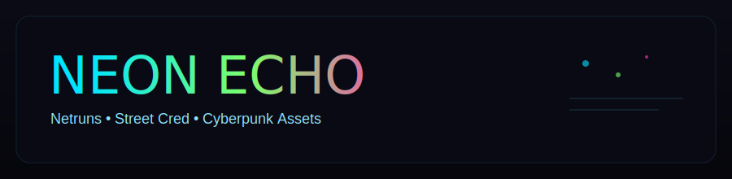

<p align="center">
  
</p>
<p align="center">
  
</p>
<p align="center">
  <a href="https://github.com/alexleo97/NeonEcho"></a>
  <a href="https://github.com/alexleo97/NeonEcho/stargazers"></a>
  <a href="https://github.com/alexleo97/NeonEcho/issues"></a>
  <a href="https://github.com/alexleo97/NeonEcho/blob/main/LICENSE"></a>
  <a href="https://github.com/alexleo97/NeonEcho/commits/main"></a>
</p>

# NEON ECHO // HYTALE MOD ⚡
NeonEcho turns your world into a low-noise cyberpunk playground: netruns, Street Cred, neon props, and a vibe you can keep expanding. 🌆

---

## FEATURE CARDS ⚡
| NETRUNS ⚡ | STREET CRED 💾 |
| --- | --- |
| Tiered hacks, cooldowns, streaks, and payouts. | Earned by play, tied to ranks and titles. |
| CYBER ASSETS 💡 | DAILY CONTRACTS 🧾 |
| Glowing panels, holo lamps, neon signage. | Daily objectives with claimable cred rewards. |

## WHAT IT FEELS LIKE 🌆
- Netrun challenges with tiers, cooldowns, and streaks.
- Street Cred that grows with play and unlocks titles.
- Daily contracts that hand out bonus cred.
- Cyberpunk props: glowing panels, holo lamps, and danger signs.

## QUICK START (SINGLEPLAYER) ⚙️
1. Drop the jar into your Mods folder.
2. Restart Hytale (mods load on startup).
3. Join your world and run `/neonhelp`.

macOS Mods path:
```
~/Library/Application Support/HytaleF2P/release/package/game/latest/Client/UserData/Mods
```

## COMMANDS 🎛️
- `/netrun` or `/netrun <tier>`: start or complete a netrun.
- `/netrunstats`: wins, fails, streaks.
- `/cred`: your Street Cred.
- `/credtop`: leaderboard.
- `/credset`: admin cred override.
- `/neonprofile`: full runner profile.
- `/contracts`: daily objectives.
- `/claim`: collect daily reward.
- `/neonstatus`: plugin status.
- `/neonmute`: toggle join message.
- `/neonreload`: reload config.

## CYBERPUNK ASSETS 💡
All assets are in the NeonEcho asset pack, so they show up in Creative search.
- `NeonEcho_Datachip`: craftable ingredient (Prisma + cyan crystal).
- `NeonEcho_NeonPanel`: glowing cyan panel block.
- `NeonEcho_HoloLamp`: hologlow lamp with particles.
- `NeonEcho_DangerSign`: neon wall sign.

## STREET CRED 💾
- Earned from chat + time online (configurable).
- Netrun success grants bonus cred; failure can subtract.
- Titles unlock at cred thresholds and show on join.
- Data persists to `data.json` in the plugin data directory.

## NETRUN TIERS 🛰️
- Defaults: `easy`, `medium`, `hard`.
- Each tier has its own code length, timer, attempts, reward, and cooldown.
- Streaks tracked across sessions.

## DAILY CONTRACTS 🧾
- Daily objectives refresh each day.
- `/contracts` shows progress, `/claim` grants reward.
- Objectives and reward are configurable.

## THEMES + CONFIG 🎨
- Theme packs: `neon`, `chrome`, `ghost`.
- Override message lines and prefix in `config.json`.
- Use `/neonreload` after edits.

## ROADMAP 🗺️
- [x] Netrun tiers with streaks and cooldown tuning.
- [x] Street Cred ranks and runner profiles.
- [x] Daily contracts with claimable rewards.
- [x] Neon asset pack with craftable props.
- [ ] Custom cyberpunk texture set (panels, decals, signage).
- [ ] Prefab-ready neon district props and lighting kit.
- [ ] Ambient soundscape + particle pass for neon zones.

## BUILD 🛠️
```sh
./gradlew build
```

Output:
```
build/libs/NeonEcho-0.0.3.jar
```

## DEV NOTES 🧪
- If Hytale lives elsewhere, set `hytale_home` in `gradle.properties` or pass `-Phytale_home=...` to Gradle.
- Entrypoint: `com.alexleo.neonecho.NeonEchoPlugin`
- Config + data live in the plugin data directory created by Hytale.

## LICENSE 📜
MIT (swap if you want a different one).
